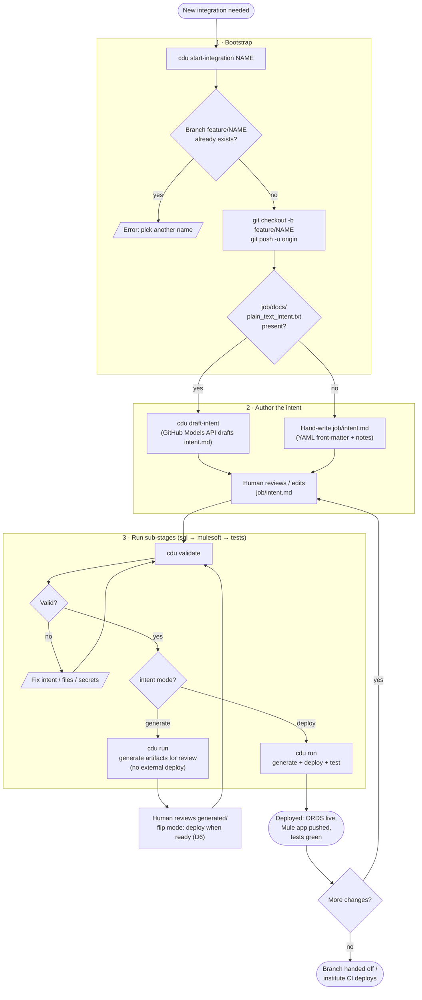
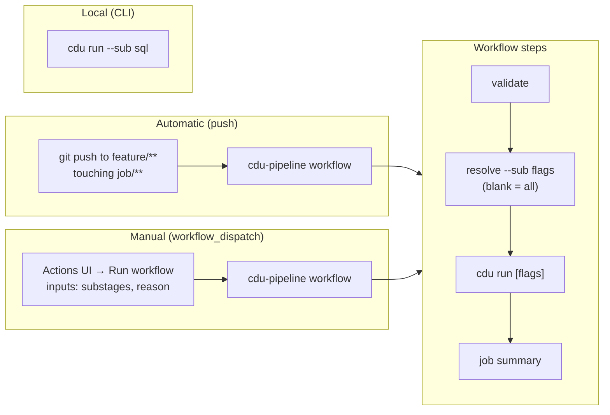
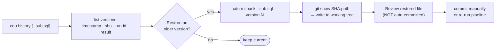
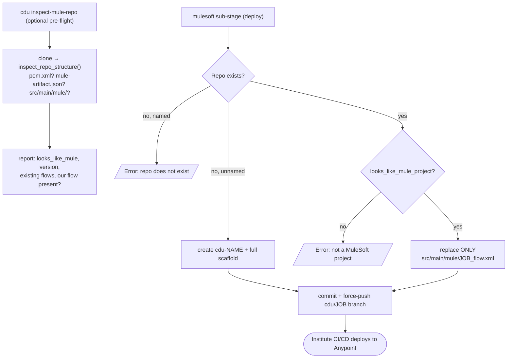

# CDU Integration Factory — End-to-End Workflow

This document is the operational map of the factory: how a single integration
goes from an idea to deployed Oracle ORDS + MuleSoft artifacts. It reflects the
sub-stage architecture (`cdu run --sub …`), the generate→deploy human gate
(D6), per-stage version history, and the GitHub Actions triggers.

For the binding architecture decisions and contracts, see
`CDU-INTEGRATION-FACTORY-SPEC.md`. This file describes the *flow*; the spec is
the source of truth for the *rules*.

---

## 1. Lifecycle at a glance



---

## 2. Sub-stage decision logic

Each sub-stage is independent and skips work that is already current. Staleness
is decided by the impact map (`pipeline/core/impact.py`) comparing the intent
front-matter and input-file hashes against the lockfile.

```mermaid
flowchart TD
    RunStart["cdu run [--sub sql|mulesoft|tests]"] --> Resolve["resolve_substages()<br/>→ canonical order: sql, mulesoft, tests"]
    Resolve --> Loop{For each<br/>requested sub-stage}

    Loop --> Kind{Which<br/>sub-stage?}

    %% sql / mulesoft path
    Kind -- sql / mulesoft --> Stale1{Artifact stale?<br/>(impact map)}
    Stale1 -- no --> Skip1["skip — record nothing"]
    Stale1 -- yes --> Snap1["snapshot prior version<br/>→ stage_history"]
    Snap1 --> Gen1["generate via GitHub Models API<br/>sanity-check + THE WALL secret scan"]
    Gen1 --> Commit1["commit generated/ + lockfile [skip ci]<br/>backfill HEAD sha into snapshot"]
    Commit1 --> Mode1{mode = deploy?}
    Mode1 -- no --> Loop
    Mode1 -- yes --> Deploy1["sql → ORDS deploy (Oracle)<br/>mulesoft → git handoff / Anypoint"]
    Deploy1 --> CommitD["commit lockfile [skip ci]"]
    CommitD --> Loop

    %% tests path
    Kind -- tests --> Stale2{Test file stale?}
    Stale2 -- yes --> Snap2["snapshot + regenerate test file<br/>commit [skip ci]"]
    Stale2 -- no --> ModeT{mode = deploy?}
    Snap2 --> ModeT
    ModeT -- no (generate) --> Skip2["skip running"]
    ModeT -- yes --> Pytest["ALWAYS run pytest<br/>(inputs may change externally)"]
    Pytest --> TPass{Passed?}
    TPass -- no --> Fail[/RunError: tests FAILED<br/>completed work stays committed/]
    TPass -- yes --> Report["write report + lockfile [skip ci]"]
    Report --> Loop

    Skip1 --> Loop
    Skip2 --> Loop
    Loop -- done --> End([RunOutcome])
```

**Key rule:** `sql` and `mulesoft` are skipped entirely when not stale; `tests`
are *always executed* in deploy mode even when the test file itself was not
regenerated, because the deployed system they probe can change independently.

---

## 3. Triggers — how `cdu run` gets invoked



The loop guard is double (spec §12): pipeline commit-backs carry `[skip ci]`
**and** the push trigger's `paths: ['job/**']` filter ignores `generated/**`
and `.cdu-lock.json`. `workflow_dispatch` runs are intentionally exempt — they
are explicitly human-initiated.

---

## 4. Version history & rollback

Every regeneration archives the prior version into `stage_history[substage]`
(newest first, capped at 10) with the git commit SHA that holds that file.



---

## 5. Existing MuleSoft repos

When `mulesoft_delivery.repo` names an existing institute repo, the factory
inspects it before touching anything.



---

## 6. The three layers of a run

| Layer | Lives in | Crosses to external systems? |
|-------|----------|------------------------------|
| **Intent** | `job/intent.md` (+ supporting `job/` files) | No — logical names only |
| **Generate** | `generated/` (SQL, Mule XML, pytest) | No — reviewable artifacts |
| **Deploy** | Oracle ORDS, MuleSoft repo/Anypoint, test run | Yes — gated behind `mode: deploy` (D6) |

**THE WALL (spec §7):** secret *values* never enter prompts or generated
output. `connections.yaml` holds secret *names*; values arrive as Actions
secrets / env vars at deploy time only; every generated file is scanned and
refused if a credential value is found.

---

## 7. Command reference

| Command | Purpose |
|---------|---------|
| `cdu start-integration NAME` | Create + push `feature/NAME`; detect plain-text intent |
| `cdu draft-intent` | AI-draft `job/intent.md` from `job/docs/plain_text_intent.txt` |
| `cdu validate` | Check intent, referenced files, connections, secrets |
| `cdu run [--sub …]` | Run sub-stages (sql → mulesoft → tests); respects mode |
| `cdu inspect-mule-repo` | Pre-flight inspection of an existing MuleSoft repo |
| `cdu history [--sub …]` | Show per-stage version trail |
| `cdu rollback --sub S [--version N]` | Restore a prior artifact version from git |
| `cdu generate` / `deploy` / `test` | Legacy single-phase commands (sub-stages preferred) |

---

*Generated as the operational companion to `CDU-INTEGRATION-FACTORY-SPEC.md`.
When the flow changes, update this diagram in the same PR.*
